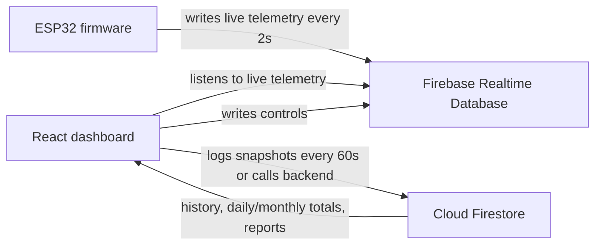

# Mustapha React Integration Guide

This file explains how the ESP32 firmware, Firebase Realtime Database, Firestore, and the dashboard work together. It is written for a React dashboard implementation.

Do not put ESP32 Wi-Fi credentials, Firebase legacy tokens, service account keys, or private API keys in React. React must use the Firebase Web SDK config and Firebase Auth.

## 1. Architecture



Current Flutter dashboard behavior:

1. ESP32 writes live telemetry to RTDB under `{unitId}/current_metrics`.
2. Dashboard listens to RTDB for live values.
3. Dashboard also listens to all 3 RTDB unit paths in the background and writes Firestore history every 60 seconds.
4. Daily and monthly energy are calculated from Firestore `sensor_readings` using positive deltas.
5. Dashboard writes derived daily/monthly summaries to RTDB under `{unitId}/energy_periods/current`.

Recommended React behavior:

1. Use RTDB for live cards and controls.
2. Use Firestore for history, daily consumption, monthly consumption, summaries, exports, and reports.
3. Prefer a Cloud Function bridge for RTDB-to-Firestore logging. If not available, React can do the same logging while the dashboard is open.

## 2. Units

| Unit ID | Device | Hardware | Main purpose |
|---|---|---|---|
| `KOFERT_Unit_1` | Lamp / AC load | PZEM-004T | AC voltage, current, power, PF, frequency, energy |
| `KOFERT_Unit_2` | Fan 5V | INA219 `0x40`, PWM, potentiometer | DC telemetry and fan speed control |
| `KOFERT_Unit_3` | Pump / reservoir | INA219 `0x41`, relay, water sensor | DC telemetry, pump control, water safety |

## 3. ESP32 Firmware Features

The ESP32 firmware does these jobs:

- Connects to Wi-Fi.
- Connects to Firebase RTDB.
- Syncs time with NTP and writes ISO timestamps.
- Reads Unit 1 AC telemetry from PZEM every 2 seconds.
- Reads Unit 2 and Unit 3 DC telemetry from INA219 every 2 seconds.
- Stores Unit 2 and Unit 3 cumulative energy in ESP32 flash using `Preferences`.
- Controls Unit 2 fan speed from local potentiometer or RTDB.
- Controls Unit 3 pump relay from RTDB, with water-level safety override.
- Writes all live values to RTDB.

Hardware pins:

| Feature | Pin |
|---|---|
| Fan potentiometer | GPIO 34 |
| Fan PWM output | GPIO 13 |
| Pump relay | GPIO 12 |
| Water level analog sensor | GPIO 32 |
| PZEM RX | GPIO 16 |
| PZEM TX | GPIO 17 |

Telemetry interval:

```text
2000 ms
```

## 4. RTDB Paths

Base live telemetry path:

```text
{unitId}/current_metrics
```

Unit IDs:

```text
KOFERT_Unit_1
KOFERT_Unit_2
KOFERT_Unit_3
```

### 4.1 Unit 1: lamp / AC

Path:

```text
KOFERT_Unit_1/current_metrics
```

Example:

```json
{
  "voltage": 215.7,
  "current": 0.027,
  "power": 4.8,
  "power_factor": 0.85,
  "energy": 0.115,
  "frequency": 50.0,
  "timestamp": "2026-06-15T12:42:26Z",
  "load_status": "active"
}
```

Units:

- `voltage`: volts
- `current`: amps
- `power`: watts
- `power_factor`: 0 to 1
- `energy`: kWh cumulative meter value from ESP32/PZEM
- `frequency`: Hz
- `timestamp`: ISO UTC string

Possible `load_status`:

```text
active
load_off
pzem_offline
```

Important physical behavior:

- If the lamp switch cuts only the lamp load and PZEM stays powered, voltage can stay around 220V while current becomes 0A.
- If the switch cuts power to the PZEM or the PZEM stops responding, the firmware forces current, power, and PF to 0 and writes `load_status = "pzem_offline"`.
- RTDB keeps the last value forever, so React must check `timestamp` to detect stale data.

### 4.2 Unit 2: fan

Live telemetry:

```text
KOFERT_Unit_2/current_metrics
```

Example:

```json
{
  "voltage": 5.03,
  "current": 0.120,
  "power": 0.604,
  "energy": 0.00292,
  "fan_speed": 65,
  "timestamp": "2026-06-15T12:42:26Z"
}
```

Control path:

```text
KOFERT_Unit_2/fan_control/speed_percent
```

Control value:

```text
0 to 100
```

Firmware behavior:

- If the local potentiometer changes, it updates PWM and writes the speed to Firebase.
- Otherwise it reads `fan_control/speed_percent` and applies it to the PWM motor output.

### 4.3 Unit 3: pump

Live telemetry:

```text
KOFERT_Unit_3/current_metrics
```

Example:

```json
{
  "voltage": 5.01,
  "current": 0.220,
  "power": 1.102,
  "energy": 0.00062,
  "water_level": 74,
  "pump_status": "ON",
  "timestamp": "2026-06-15T12:42:26Z"
}
```

Control path:

```text
KOFERT_Unit_3/current_metrics/pump_status
```

Values:

```text
ON
OFF
```

Safety rule:

```text
if water_level <= 30, firmware forces pump_status = OFF
```

## 5. Derived RTDB Period Summary

The dashboard can write daily/monthly summaries to:

```text
{unitId}/energy_periods/current
```

Example:

```json
{
  "unit_id": "KOFERT_Unit_1",
  "daily_energy_mwh": 115000,
  "daily_energy_kwh": 0.115,
  "daily_date": "2026-06-15",
  "monthly_energy_mwh": 115000,
  "monthly_energy_kwh": 0.115,
  "month": "2026-06",
  "updated_at": 1781512345678,
  "source": "dashboard_firestore_rtdb"
}
```

React can read this for quick display, but Firestore is the more reliable source for recalculating period totals.

## 6. Firestore Collections

### 6.1 `sensor_readings`

Append-only time-series history:

```text
sensor_readings/{autoId}
```

Fields:

```json
{
  "unitId": "KOFERT_Unit_1",
  "timestamp": "Firestore Timestamp",
  "loggedAt": "Firestore serverTimestamp",
  "dayKey": "2026-06-15",
  "monthKey": "2026-06",
  "voltage": 215.7,
  "current": 0.027,
  "power": 4.8,
  "powerFactor": 0.85,
  "apparentPower": 5.82,
  "reactivePower": 3.2,
  "energy": 115000,
  "frequency": 50.0
}
```

Important:

- RTDB `energy` is kWh.
- Firestore `energy` should be mWh.
- Convert before writing Firestore:

```js
energyMwh = energyKwh * 1000000;
```

Extra Unit 2 field:

```json
{ "fanSpeed": 65 }
```

Extra Unit 3 field:

```json
{ "waterLevel": 74 }
```

### 6.2 `unit_status`

Latest Firestore snapshot per unit:

```text
unit_status/{unitId}
```

Same payload as `sensor_readings`, plus:

```json
{
  "updatedAt": "Firestore serverTimestamp"
}
```

Use this for latest known status if RTDB is unavailable.

### 6.3 `alerts`

Alert history:

```text
alerts/{alertId}
```

Example:

```json
{
  "unitId": "KOFERT_Unit_1",
  "title": "Surtension",
  "detail": "252.1 V",
  "colorValue": 4294901760,
  "timestamp": "Firestore serverTimestamp"
}
```

## 7. Energy Calculation Rules

The ESP32 energy is cumulative, like an odometer. Never sum cumulative readings directly.

Wrong:

```js
const total = readings.reduce((sum, r) => sum + r.energy, 0);
```

Correct:

1. Sort readings by timestamp ascending.
2. Convert each energy value to mWh.
3. Sum only positive deltas.
4. Ignore negative deltas because they mean a reset/reboot.
5. Ignore huge spikes.

```js
function normalizeStoredEnergyMwh(value, unitId) {
  if (!Number.isFinite(value) || value <= 0) return 0;
  const looksLikeRawKwh =
    value < 10 || (unitId === "KOFERT_Unit_1" && value < 1000);
  return looksLikeRawKwh ? value * 1000000 : value;
}

function sumPositiveEnergyDeltasMwh(readingsMwh, maxDeltaMwh = 1e9) {
  let total = 0;
  let previous = null;

  for (const current of readingsMwh) {
    if (!Number.isFinite(current)) continue;
    if (previous !== null) {
      const delta = current - previous;
      if (delta > 0 && delta < maxDeltaMwh) total += delta;
    }
    previous = current;
  }

  return total;
}
```

Daily query:

```text
unitId == selected unit
timestamp >= start of today
timestamp < start of tomorrow
orderBy timestamp ascending
```

Monthly query:

```text
unitId == selected unit
timestamp >= first day of current month
timestamp < first day of next month
orderBy timestamp ascending
```

UI safeguard:

```js
monthlyDisplayed = Math.max(monthlyEnergyMwh, dailyEnergyMwh);
```

Estimated cost:

```js
costMad = (energyMwh / 1000000) * tariffRateMadPerKwh;
```

Current tariff shown by the dashboard:

```text
1.15 MAD/kWh
```

## 8. React Firebase Setup

Install:

```bash
npm install firebase
```

Example:

```js
import { initializeApp } from "firebase/app";
import { getDatabase } from "firebase/database";
import { getFirestore } from "firebase/firestore";
import { getAuth } from "firebase/auth";

const firebaseConfig = {
  apiKey: "YOUR_WEB_API_KEY",
  authDomain: "ocp-energy-monitor.firebaseapp.com",
  databaseURL:
    "https://ocp-energy-monitor-default-rtdb.europe-west1.firebasedatabase.app",
  projectId: "ocp-energy-monitor",
  storageBucket: "ocp-energy-monitor.firebasestorage.app",
  messagingSenderId: "544635807392",
  appId: "YOUR_WEB_APP_ID"
};

export const app = initializeApp(firebaseConfig);
export const rtdb = getDatabase(app);
export const db = getFirestore(app);
export const auth = getAuth(app);
```

Do not use the ESP32 legacy token in React.

## 9. React Live Listener

```js
import { ref, onValue } from "firebase/database";
import { rtdb } from "./firebase";

export function subscribeCurrentMetrics(unitId, callback) {
  const unitRef = ref(rtdb, `${unitId}/current_metrics`);
  return onValue(unitRef, (snapshot) => {
    callback(snapshot.exists() ? snapshot.val() : null);
  });
}
```

Hook:

```js
import { useEffect, useState } from "react";

export function useCurrentMetrics(unitId) {
  const [data, setData] = useState(null);

  useEffect(() => {
    if (!unitId) return;
    const unsubscribe = subscribeCurrentMetrics(unitId, setData);
    return () => unsubscribe();
  }, [unitId]);

  return data;
}
```

Parser:

```js
function parseEnergyData(raw, unitId) {
  if (!raw) return null;

  const isINA219 =
    unitId === "KOFERT_Unit_2" || unitId === "KOFERT_Unit_3";

  let current = Number(raw.current ?? 0);
  let power = Number(raw.power ?? 0);
  let powerFactor = Number(raw.power_factor ?? raw.powerFactor ?? 0);

  if (
    unitId === "KOFERT_Unit_1" &&
    Math.abs(power) <= 0.5 &&
    Math.abs(current) <= 0.005
  ) {
    current = 0;
    power = 0;
    powerFactor = 0;
  }

  return {
    unitId,
    isINA219,
    voltage: Number(raw.voltage ?? 0),
    current,
    power,
    powerFactor,
    energyMwh: Number(raw.energy ?? 0) * 1000000,
    frequency: Number(raw.frequency ?? 50),
    fanSpeed: Number(raw.fan_speed ?? raw.fanSpeed ?? 0),
    waterLevel: Number(raw.water_level ?? raw.waterLevel ?? 0),
    pumpStatus: raw.pump_status ?? "OFF",
    loadStatus: raw.load_status ?? null,
    timestamp: raw.timestamp ? new Date(raw.timestamp) : new Date()
  };
}
```

## 10. Stale Data Detection

RTDB stores the last value. If the ESP32 stops writing, old current/power can still appear.

Use timestamp age:

```js
function isStale(timestamp, maxAgeSeconds = 90) {
  if (!timestamp) return true;
  return Date.now() - new Date(timestamp).getTime() > maxAgeSeconds * 1000;
}
```

If stale:

- Show "Offline" or "Data stale".
- Gray out live cards.
- Do not trust current/power as real-time values.

## 11. React Controls

### Fan speed

```js
import { ref, set } from "firebase/database";
import { rtdb } from "./firebase";

export function setFanSpeedPercent(percent) {
  const value = Math.max(0, Math.min(100, Number(percent)));
  return set(ref(rtdb, "KOFERT_Unit_2/fan_control/speed_percent"), value);
}
```

### Pump status

```js
import { ref, set } from "firebase/database";
import { rtdb } from "./firebase";

export function setPumpStatus(status) {
  const value = status === "ON" ? "ON" : "OFF";
  return set(ref(rtdb, "KOFERT_Unit_3/current_metrics/pump_status"), value);
}
```

Remember: firmware forces pump OFF if water level is `<= 30`.

## 12. Firestore Logging from React

If React is responsible for history logging, throttle writes to once per 60 seconds per unit.

Firestore rules require the authenticated user role to be:

```text
admin, moderator, or operator
```

Example:

```js
import {
  addDoc,
  collection,
  doc,
  serverTimestamp,
  setDoc,
  Timestamp
} from "firebase/firestore";
import { db } from "./firebase";

const lastWrite = new Map();

function toFirestorePayload(data) {
  const apparentPower = data.voltage * data.current;
  const q2 = apparentPower * apparentPower - data.power * data.power;
  const reactivePower = q2 > 0 ? Math.sqrt(q2) : 0;

  const timestamp = data.timestamp ?? new Date();
  const yyyy = timestamp.getFullYear();
  const mm = String(timestamp.getMonth() + 1).padStart(2, "0");
  const dd = String(timestamp.getDate()).padStart(2, "0");

  const payload = {
    unitId: data.unitId,
    timestamp: Timestamp.fromDate(timestamp),
    dayKey: `${yyyy}-${mm}-${dd}`,
    monthKey: `${yyyy}-${mm}`,
    voltage: data.voltage,
    current: data.current,
    power: data.power,
    powerFactor: data.powerFactor,
    apparentPower,
    reactivePower,
    energy: data.energyMwh
  };

  if (!data.isINA219) payload.frequency = data.frequency;
  if (data.unitId === "KOFERT_Unit_2") payload.fanSpeed = data.fanSpeed;
  if (data.unitId === "KOFERT_Unit_3") payload.waterLevel = data.waterLevel;

  return payload;
}

export async function logReading(data) {
  const now = Date.now();
  const previous = lastWrite.get(data.unitId) ?? 0;
  if (now - previous < 60000) return;
  lastWrite.set(data.unitId, now);

  const payload = toFirestorePayload(data);

  await addDoc(collection(db, "sensor_readings"), {
    ...payload,
    loggedAt: serverTimestamp()
  });

  await setDoc(
    doc(db, "unit_status", data.unitId),
    {
      ...payload,
      updatedAt: serverTimestamp()
    },
    { merge: true }
  );
}
```

## 13. Period Energy Queries

```js
import {
  collection,
  getDocs,
  orderBy,
  query,
  Timestamp,
  where
} from "firebase/firestore";
import { db } from "./firebase";

async function getPeriodEnergy(unitId, start, end) {
  const q = query(
    collection(db, "sensor_readings"),
    where("unitId", "==", unitId),
    where("timestamp", ">=", Timestamp.fromDate(start)),
    where("timestamp", "<", Timestamp.fromDate(end)),
    orderBy("timestamp", "asc")
  );

  const snap = await getDocs(q);
  const readingsMwh = [];

  snap.forEach((docSnap) => {
    const d = docSnap.data();
    readingsMwh.push(normalizeStoredEnergyMwh(Number(d.energy ?? 0), unitId));
  });

  return sumPositiveEnergyDeltasMwh(readingsMwh);
}

export function startOfToday() {
  const d = new Date();
  return new Date(d.getFullYear(), d.getMonth(), d.getDate());
}

export function startOfTomorrow() {
  const d = startOfToday();
  return new Date(d.getFullYear(), d.getMonth(), d.getDate() + 1);
}

export function startOfMonth() {
  const d = new Date();
  return new Date(d.getFullYear(), d.getMonth(), 1);
}

export function startOfNextMonth() {
  const d = new Date();
  return new Date(d.getFullYear(), d.getMonth() + 1, 1);
}

export async function getDailyEnergy(unitId) {
  return getPeriodEnergy(unitId, startOfToday(), startOfTomorrow());
}

export async function getMonthlyEnergy(unitId) {
  return getPeriodEnergy(unitId, startOfMonth(), startOfNextMonth());
}
```

## 14. Alert Rules

Unit 1 AC:

| Alert | Condition |
|---|---|
| High voltage | `voltage > 250` |
| Low voltage | `voltage < 200` |
| High current | `current > 50` |
| Low PF | `powerFactor < 0.8 && powerFactor > 0` |

Unit 2 and 3 DC:

| Alert | Condition |
|---|---|
| High voltage | `voltage > 5.5` |
| Low voltage | `voltage < 4.0` |
| High current | `current > 3.0` |

Stale data:

```text
timestamp older than 90 seconds
```

## 15. React Feature Checklist

Must-have:

- Firebase Auth login.
- Unit selector.
- RTDB live listener for selected unit.
- Cards for power, daily energy, monthly energy, voltage, current, estimated cost.
- Frequency for Unit 1.
- Fan speed display/control for Unit 2.
- Water level and pump control for Unit 3.
- Stale/offline badge using timestamp.
- Firestore history logging or Cloud Function bridge.
- Daily/monthly energy from positive deltas.

Nice-to-have:

- Charts for power, voltage, current, energy, power factor.
- Alert history.
- Browser notifications.
- User roles.
- Maintenance screen.
- Global chat/direct messages.
- Export/report screens.

## 16. Common Mistakes

1. Do not sum cumulative `energy` readings.
2. Do not trust RTDB values without checking timestamp.
3. Do not put ESP32 Firebase legacy token in React.
4. Do not display RTDB kWh as mWh without conversion.
5. Do not expect pump ON to stay ON when water level is low.
6. Do not rely on client-side Firestore logging for production if nobody may have the dashboard open.

## 17. Minimal Mental Model

```text
ESP32 -> RTDB current_metrics -> React live UI
RTDB snapshots -> Firestore sensor_readings -> history/daily/monthly
React controls -> RTDB control paths -> ESP32 hardware action
```

